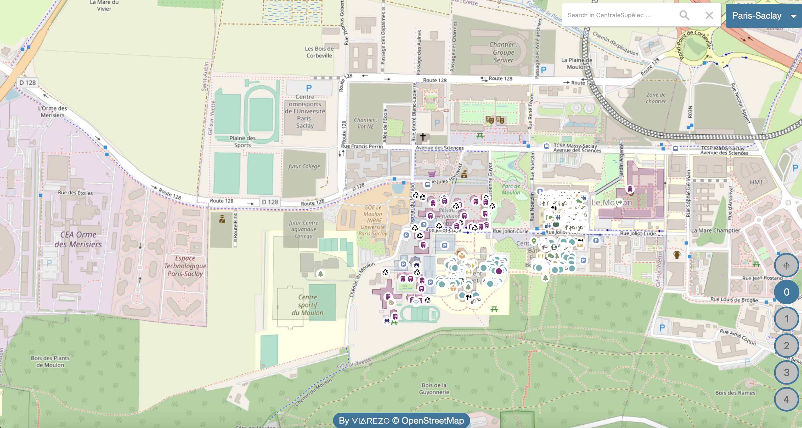

# CampusMap

- [CampusMap](#campusmap)
  - [Description](#description)
  - [Production use](#production-use)
  - [Install and run locally](#install-and-run-locally)
  - [Use this project](#use-this-project)
  - [Add or edit a building](#add-or-edit-a-building)
  - [License](#license)
  - [Contributing](#contributing)
  - [Detailed description](#detailed-description)
    - [_So how does it work ?_](#so-how-does-it-work-)
    - [_What type of data is used ?_](#what-type-of-data-is-used-)
    - [Data structure](#data-structure)
    - [Repository](#repository)

## Description

This project developed by a CentraleSupélec's student aims at creating a map for CentraleSupélec's 3 campuses.

It is a simple static Web Page integrating OpenStreetMap's API and CentraleSupélec's building details into a full screen map, optimized for mobile phones too.

_[CentraleSupelec map](http://maps.centralesupelec.fr) example_


## Production use

In a production environnement, it is crucial to have HTTPS encryption or else the copy button in a feature's popup won't work. (read more about this here <https://stackoverflow.com/questions/51805395/navigator-clipboard-is-undefined>)

Change the variable `HOST_URL` in `src/views/map.js` accordingly and run `npm run build` to update the `dist` directory.

## Install and run locally

The Web App runs in a docker container using the _nginxinc/nginx-unprivileged:alpine_ image (for security issues it is best not to run a docker as root and alpine is a very lightweight linux disto perfect for production). The containered form is needed, even if the app is static, because it makes GET calls to the is denied by CORS policy if it's served locally (Cross-Origin Resource Sharing is a standard mechanism that allows JavaScript XMLHttpRequest (XHR) calls executed in a web page to interact with resources from non-origin domains)

If you are only interesed in running the app locally without changing the source code, _to see how it feels_, run the following commands:

- `npm run prod`
- `npm run stop-prod`, _to stop it_

If you want to run the app locally and make changes to the code, run `npm run dev` to start the web-server and `npm run stop-dev` to stop it

## Use this project

This project can natively display the maps of CentraleSupélec's 3 campuses, furthermore it can be adapted and used to create a map for any campus or other structures, more details on the potential of Leaflet library [here](https://leafletjs.com/).

To add elements to the map, follow the tutorial video `tutorial.webm` (open it with a web browser).

To add your campuses :

1. please refer to & edit `src/data/campuses.js` for all needed informations ;
2. you will need svg files of your floors, as in `src/assets/svg`, with the same naming convention ;
3. please refer to & edit `src/views/buildingsInfo.js` to add last informations needed.
4. don't forget to build !

## Add or edit a building

1. Create or edit svg plans of each floors in `src/assets/svg` (respect naming convention) - see `resources/floorPlans/README.md`
2. Remove data in `src/data` with `draw/draw.py` - see `draw/README.md`
3. Position them on the map by changing the coordinates of the points in the file `src/views/buildingsInfo.js`
4. If there are additional floors or floor number changes, adapt the file `src/utils/goToCampus.js`
5. Draw new rooms on plans with URI `<url>?draw=true`
6. Add them to `src/data` with the `draw/draw.py` application - consult `draw/README.md`.

Two tutorials have been prepared:

- tutorial.webm : to draw with `draw/draw.py` and `HOST_URL/?draw=true`
- tutorial2.webm : to remove rooms with `draw/draw.py`

Note that there are two ways of modifying an element:

- Either delete it and redesign it.
- Either modify the database files directly by hand: **4 FILES NEED TO BE MODIFIED : json `src/data/cs_<campus>_<floor>.json`, josn `src/data/cs_<campus>_search.json`, json `src/data/cs_searchByURL.json` and csv ``src/data/cs_features_data.csv`**.

## License

This project is provided with _MIT license_ and uses 3 open-source JS libraries and 1 Leaflet plugin having the following licenses:

- Leaflet _BSD 2-Clause license_
- jQuery _MIT license_
- FuseJS _Apache 2.0 license_
- Leaflet.GeoJSONAutocomplete _MIT license_

> _For more details refer to [LICENSE.dependencies.md](LICENSE.dependencies.md) file_

## Contributing

Some features that are yet to be implemented :

- Implement scrooling in the search box
- Improve FuseJS algorithm
- Fix the floor color bug on Eiffel & Bouygues making floors gray instead of yellow
- Adapt icons sizes & room names with zoom level (check [this](https://stackoverflow.com/questions/46015066/leaflet-custom-icon-resize-on-zoom-performance-icon-vs-divicon)

## Detailed description

### _So how does it work ?_

This static website is build using HTML, CSS and Vanilla JavaScript with 3 JS libraries:

- [Leaflet](https://leafletjs.com/), a JS library enabling you to call map APIs like [OSM](https://www.openstreetmap.org/), [Mapbox](https://www.mapbox.com/), [Google Maps](https://mapsplatform.google.com/), ... and customize them
- [JQuery](https://jquery.com/) a JS library designed to simplify HTML DOM tree traversal and manipulation, as well as event handling, CSS animation, and Ajax.
- [Fuse](https://fusejs.io/) a JS library to implement fusy search

_Remark_ : (Another alternative to Leaflet is [OpenLayers](https://openlayers.org/) which more complex and richer but for our current use, Leaflet is simple, easy and get's the job done, more info on the comparaison between these 2 [here](https://gis.stackexchange.com/questions/33918/choosing-openlayers-or-leaflet)).

The map provider chosen is the only open-source option : OpenStreetMap, more precisely the [french version](https://www.openstreetmap.fr/).

### _What type of data is used ?_

When working on a GIS (_Geographic Information System_), several types of data can be used, such as CSVs, GeoJSONs ... We will be utilizing the GeoJSON format (more details [_here_](https://geojson.org)). It consists of a JSON file following the structure below :

```JSON
{
    "type": "FeatureCollection",
    "features": [
        {
            "type": "Feature",
            "geometry": {
                "type": "",
                "coordinates": [],
            },
            "properties": {}
        }
    ]
}
```

Each map feature is an element of the "features" array, having a specific geometry (type : Point, Polygon, ... ; coordinates : defined according to the previous type, see [this RFC](https://datatracker.ietf.org/doc/html/rfc7946) for more details) and a set of properties defined by the developper to customize the map feature when displayed with _Leaflet_.

### Data structure

Data has been chosen as follows:

- one JSON to search all the elements by URL request
- one JSON per area to search all elements in that location with the search bar (ps, metz, rennes)
- one JSON per floor per area that loads the elements of the floor corresponding to that location => have a light http request and not load all floors at once for a specific location or everything at once which cause browser lagging

These are all stored in simple basic json files for performance and simplicity (no database allowed at the start of the project). If we could get a database (MongoDB preferably) we could store the data in a more structured way and make it easier to add/remove new data ...

### Repository

The repo is organized as following :

```TXT
campusmap
├── draw/                 -> Draw App directory, see draw/README.md for more details
├── node_modules/         -> node modules for webpack, ignored by git
├── resources/            -> Resources folder for the whole project
│   ├── data/               -> see resources/data/README.md for more details
│   ├── floorPlans/         -> Floor plans for the 3 campuses, see resources/floorPlans/README.md for more details
│   └── icons/              -> Icons for the map features
├── src/                    -> Source code project
│   ├── assets/             -> Assets folder
|   |   ├── icons/                   -> A copy of ../../ressources/icons
│   |   └── svg/                     -> A modified version of ../../ressources/floorPlans
|   ├──components/          -> Map components
|   |   ├── autocompleteSearchBox.js -> Autocomplete search box
|   |   ├── campusSelector.js        -> Campus selector
|   |   └── markers.js               -> Features markers
│   ├── data/*              -> Data generated by ../resources/data/data.py and /draw/draw.py
|   ├── lib/                -> Libraries used in the web app
|   |   ├── fuse/                    -> FuseJS library
|   |   ├── jquery/                  -> JQuery library
|   |   └── leaflet/                 -> Leaflet library
|   ├── styles/             -> Stylesheets used in web app
|   |   ├── image/                   -> Images for the search box
|   |   ├── campusSelection.css      -> Stylesheet for the component y
|   |   ├── floorButtons.css         -> //
|   |   ├── footer.css               -> //
|   |   ├── map.css                  -> //
|   |   └── searchBox.css            -> //
│   ├── utils/              -> Utils functions
|   |   ├── addaData.js              -> Add data to the map
|   |   ├── downloadDrawData.js      -> Define how drawn data is downloaded
|   |   ├── findByUrl.js             -> Find a feature by its URL
|   |   ├── goToCampus.js            -> Go to a campus
|   |   ├── locationCookie.js        -> Location cookie
│   |   └── tools.js                 -> Tools
│   ├── views/              -> Views elemnents
|   |   ├── buildingPosition.js      -> Define building position
|   |   ├── draw.js                  -> Define Leaflet Draw component
|   |   ├── featureDisplay.js        -> Display the features on the map
│   |   └── map.js                   -> Display the map
|   ├── index.css           -> Main stylesheet
|   ├── index.html          -> Main HTML file
|   └── index.js            -> Main JS file
├── .gitignore               -> gitignore file
├── create_dist.sh           -> Script to create the distribution folder
├── docker-compose.dev.yaml  -> Docker-compose config for development server
├── docker-compose.prod.yaml -> Docker-compose config for production server
├── Dockerfile               -> Dockerfile for the K8s image
├── LICENSE.md               -> Licenses for the project
├── LICENSE.dependencies.md  -> Licenses for the project
├── package-lock.json        -> Package lock file
├── package.json             -> NPM packages
├── README.md                -> Project information
└── webpack.config.js        -> Webpack config
```

## Documentation

To edit the documentation website, you can serve a local mkdocs instance : `docker run --rm -it -p 8000:8000 -v ${PWD}:/docs squidfunk/mkdocs-material`
